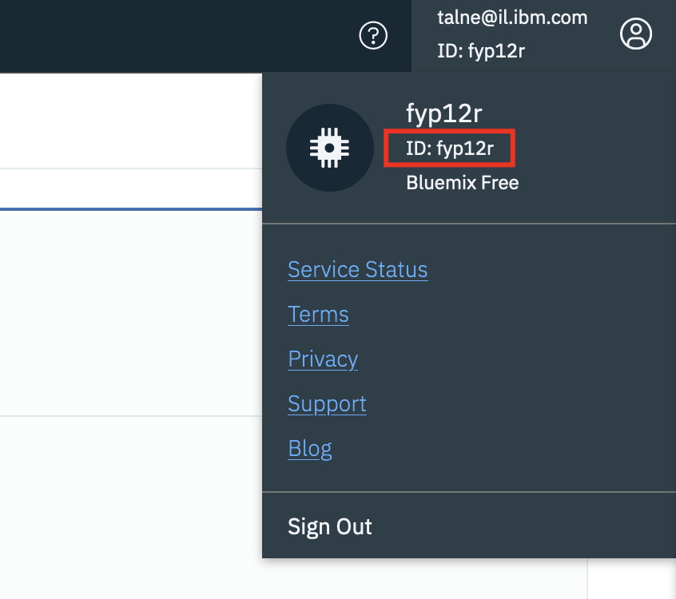
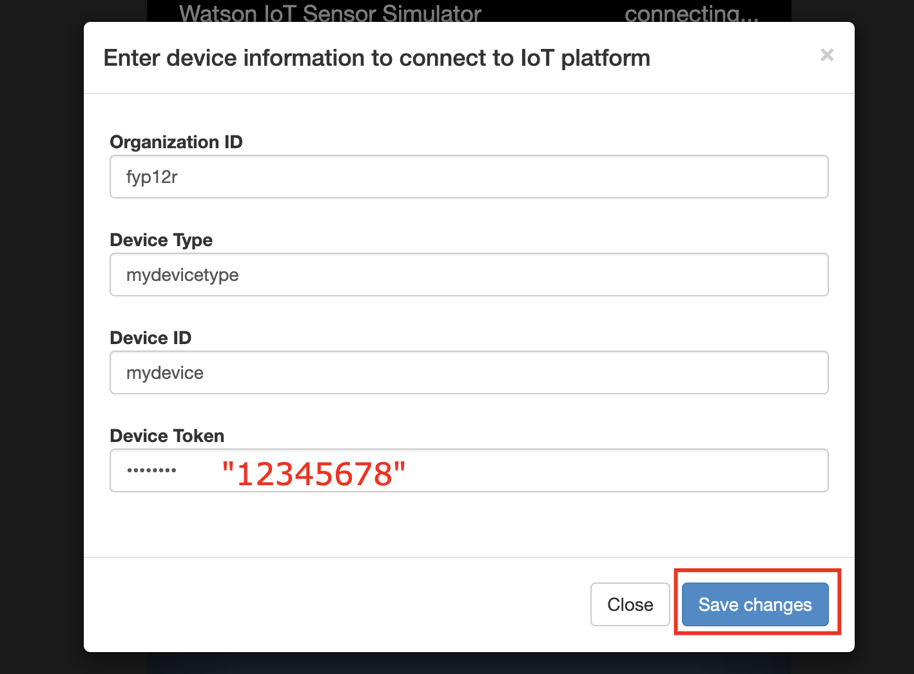
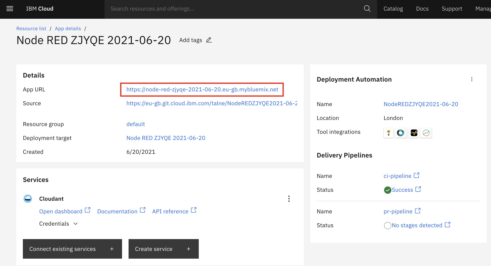
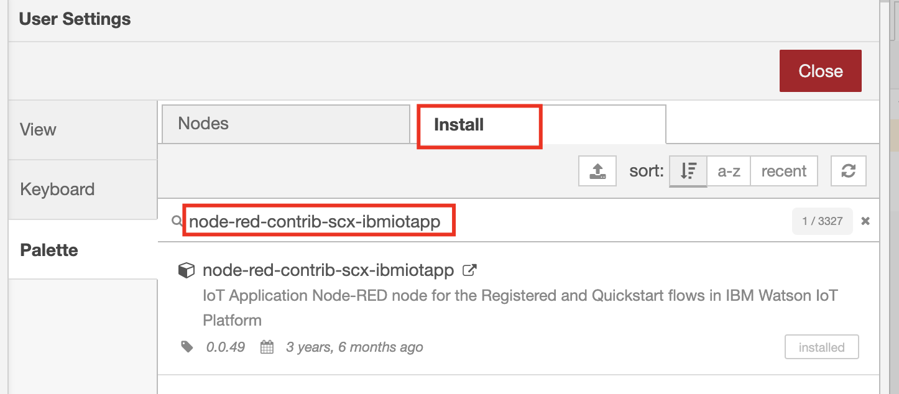
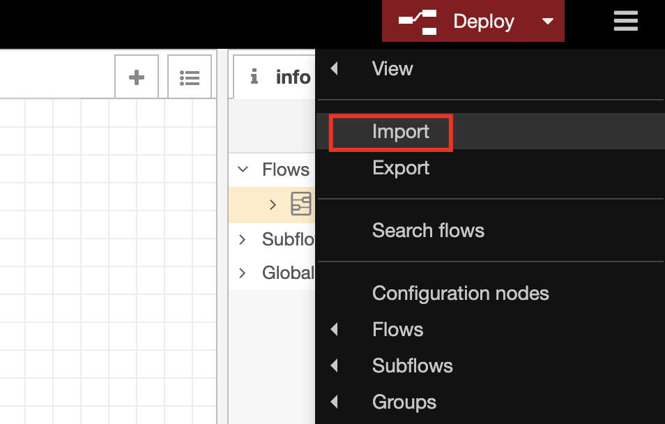
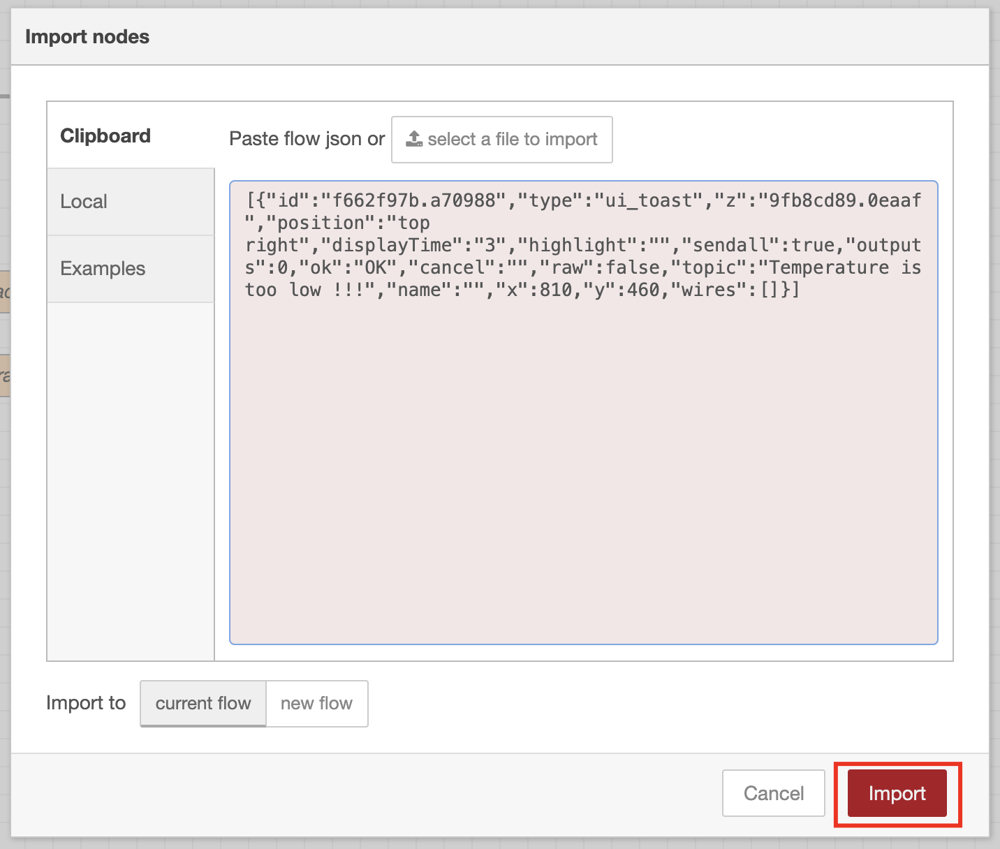

# Node-red-IoT

## Tutorial link

https://developer.ibm.com/tutorials/how-to-create-an-internet-of-things-platform-starter-application/

After you created the IoT platform you can start work with it.
First thing you will need is the organization ID you can find it on the top right corner:

Save it in the Cheatsheet.txt.

### Add a Device Type in the IBM Watson IoT Platform service
1) From the sidebar, select Devices.
2) On the Devices page, select the Device Types tab.
3) Click Add Device Type to open the Add Type form.
4) Select Device for the Type.
5) Enter a unique Name for the device type (but you need to remember it :) ).
6) You can save the device type in the Cheatsheet.txt under "device_type".
7) Click Next.
8) Click Finish.

### Add a Device in the IBM Watson IoT Platform service
1) From the sidebar, select Devices.
2) On the Devices page, select the Browse tab.
3) Click Add Device to open the Add Device form.
4) For Device Type, select the device type created earlier.
5) Enter a unique Device ID for the device.
6) You can save the device ID in the Cheatsheet.txt under "device_id".
7) Click Next.
8) Click Next on the Device Information screen.
9) Enter simple Authentication Token (like "12345678" so you can remember it).
10) You can save the Authentication Token in the Cheatsheet.txt under "device_auth_token".
11) Click Next on the Security screen.
12) Click Finish.

### Generate an API Key
1) From the sidebar, select Apps.
2) On the App page, select the Browse tab.
3) Click Generate API Key to open the Generate API Key form.
4) (optional) Enter a Description for the key.
5) (optional) Enable and set a date for API Key Expires.
6) Click Next.
7) Select Standard Application for the Role.
8) Click Generate Key.
9) Save the API Key + Authentication Token in the Cheatsheet.txt under "api_key" + "api_auth_token".

## IoT Sensor

Go to: https://watson-iot-sensor-simulator.mybluemix.net/

Fill the information you got earlier when you created your device (you can take it from the Cheatsheet.txt)

## Palette to Install

Go to your Node-Red application from this link:

Do the initial setup and go to the flow editor, click on the Manage Pallete:

Go to Install and copy the packages below:
- node-red-contrib-scx-ibmiotapp
- node-red-dashboard

## Add the flows.json

Click on the Import:

Copy the flows.json and paste it:

